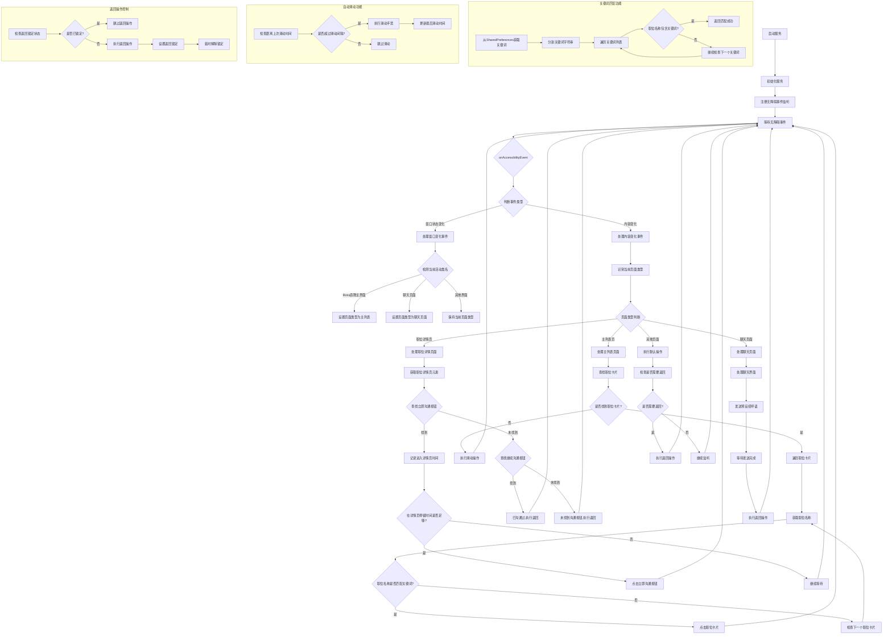

# BOSS直聘自动投递


一个基于Android无障碍服务的BOSS直聘自动投递工具，通过AI驱动的界面识别和精确控制，实现招聘应用的全自动化操作。

[](https://youtu.be/EqYfixZ9er4)

## 🌟 核心技术亮点

- **高级无障碍服务实现**：利用AccessibilityService深度集成系统操作能力
- **多层次页面状态检测**：通过节点特征组合判断精确定位当前页面类型
- **智能失败恢复机制**：自动检测操作失败并通过多策略重试确保任务连续性
- **基于UI的状态机模型**：摒弃传统导航栈，实现纯UI状态驱动的操作流程
- **精确节点查找算法**：多维度节点特征匹配，确保在各种UI变化中稳定找到目标元素

## 🔍 工作原理详解

### 页面识别机制

系统采用多特征组合识别方法确定当前所处的页面类型：

```java
private PageType detectPageFromUI(AccessibilityNodeInfo rootNode) {
    // 1. 主界面(MAIN_LIST)判断标准
    List<AccessibilityNodeInfo> tabNodes = rootNode.findAccessibilityNodeInfosByText("职位");
    boolean positionTabSelected = false;
    for (AccessibilityNodeInfo node : tabNodes) {
        if (node.isSelected()) {
            positionTabSelected = true;
            break;
        }
    }
    
    List<AccessibilityNodeInfo> recommendNodes = rootNode.findAccessibilityNodeInfosByText("推荐");
    // 更多特征检测逻辑...
    
    if (positionTabSelected && (!recommendNodes.isEmpty() || !nearbyNodes.isEmpty())) {
        return PageType.MAIN_LIST;
    }
    
    // 2. 职位详情页与聊天页面判断
    // 基于关键UI元素和位置特征判断...
}
```

### 智能职位匹配

系统通过预定义的关键词集对职位进行智能过滤：

```java
private boolean matchesKeywords(String jobTitle) {
    if (jobTitle == null || jobTitle.isEmpty()) {
        return false;
    }
    
    jobTitle = jobTitle.toLowerCase();
    for (String keyword : keywords) {
        if (jobTitle.contains(keyword.toLowerCase())) {
            return true;
        }
    }
    return false;
}
```

### 自适应点击策略

根据不同场景采用最合适的交互方式：

1. **节点点击**：当目标元素可点击且可访问时
2. **父节点点击**：当目标元素不可点击但父节点可点击时
3. **坐标点击**：当节点点击方法失效时，通过精确坐标实现

### 防检测与稳定性措施

- **动态时间延迟**：非线性时间间隔，模拟人类操作习惯
- **操作频率控制**：限制点击和滑动频率，避免触发平台反作弊机制
- **会话状态恢复**：自动检测APP退出状态并重启应用

## 📊 系统架构

### 核心组件

1. **BossResumeService**：继承自AccessibilityService，是整个系统的核心引擎
2. **页面处理器**：针对不同页面类型的专用处理逻辑
3. **节点查找引擎**：通过多维度特征组合定位界面元素
4. **操作执行器**：实现点击、滑动、返回等各类交互操作
5. **状态管理器**：维护应用整体状态与操作上下文

### 事件流转流程

```
接收无障碍事件 → 页面类型检测 → 状态更新 → 选择处理策略 → 执行操作 → 结果校验 → 后续流程决策
```

### 流程图


这个流程图详细展示了BossResumeService的工作流程：

1. **服务生命周期**：从启动到初始化，然后监听无障碍事件
2. **页面识别逻辑**：如何识别不同页面类型并转换状态
3. **职位列表处理**：如何查找和匹配职位卡片
4. **职位详情处理**：如何处理立即沟通和继续沟通按钮
5. **聊天界面处理**：如何发送消息并返回
6. **辅助功能**：关键词匹配、自动滑动和返回操作控制


# BOSS直聘自动投递服务完整流程说明

## 服务初始化与启动

1. **服务启动**：用户在主界面选择职位类别或输入自定义关键词，点击"开始投递"按钮
2. **参数读取**：服务从SharedPreferences获取关键词设置
3. **初始化**：初始化各种状态变量、定时器和界面识别机制

## 事件监听与页面识别

1. **无障碍事件监听**：服务持续监听BOSS直聘应用的无障碍事件
2. **窗口状态变化处理**：
   - 检测到MainActivity：识别为职位列表主页面
   - 检测到ChatRoomActivity：识别为聊天页面
   - 其他界面：保持当前页面状态

3. **内容变化处理**：
   - 通过特定元素判断当前页面类型（职位标签、立即沟通按钮等）
   - 更新当前页面状态（MAIN_LIST, JOB_DETAIL, CHAT_PAGE）

## 职位列表页面处理

1. **查找职位卡片**：
   - 尝试查找RecyclerView中的职位卡片
   - 如未找到，尝试查找单个职位卡片

2. **职位匹配**：
   - 遍历所有找到的职位卡片
   - 获取每个职位的名称文本
   - 检查职位名称是否包含预设关键词

3. **点击匹配职位**：
   - 找到匹配关键词的职位后，点击该职位卡片
   - 记录已点击过的职位，避免重复点击

4. **自动滑动**：
   - 如果未找到匹配的职位或处理完所有可见职位
   - 检查是否达到滑动间隔时间（默认7秒）
   - 执行向下滑动操作查找更多职位

## 职位详情页面处理

1. **界面识别**：通过"立即沟通"按钮识别为职位详情页
2. **按钮判断**：
   - 查找"立即沟通"按钮
   - 如未找到，查找"继续沟通"按钮
   
3. **处理立即沟通**：
   - 找到"立即沟通"按钮时，记录进入详情页时间
   - 等待一定时间（确保页面加载完成）
   - 点击"立即沟通"按钮进入聊天界面
   
4. **处理继续沟通**：
   - 找到"继续沟通"按钮时，判定为已投递过
   - 直接执行返回操作，回到职位列表
   - 不会点击"继续沟通"按钮，避免重复投递

5. **超时处理**：
   - 在详情页停留超过预设时间（通常3秒）后
   - 如未成功找到沟通按钮，执行返回操作

## 聊天页面处理

1. **界面识别**：通过特定活动类名识别为聊天页面
2. **消息发送**：
   - 查找消息输入框
   - 输入预设招呼语
   - 点击发送按钮
   
3. **完成处理**：
   - 等待消息发送完成
   - 执行返回操作回到职位列表
   - 更新已处理职位计数

## 辅助功能

1. **关键词匹配**：
   - 从SharedPreferences获取关键词字符串
   - 按逗号分割成关键词列表
   - 遍历匹配职位名称是否包含任一关键词
   
2. **自动滑动控制**：
   - 定时检查是否需要滑动（距上次滑动7秒以上）
   - 执行垂直滑动手势（90%→10%屏幕位置）
   - 更新最后滑动时间戳
   
3. **返回操作控制**：
   - 使用返回锁定机制避免短时间内多次返回
   - 执行返回后锁定一定时间（通常1秒）
   - 自动解锁继续后续操作

## 异常处理

1. **界面识别失败**：
   - 未能识别当前页面类型时执行默认处理
   - 通常是执行返回操作尝试回到已知页面状态
   
2. **元素查找失败**：
   - 找不到目标元素时使用备选查找策略
   - 超时后执行返回操作避免卡在未知状态

3. **计数与限制**：
   - 记录已处理职位数量
   - 达到预设上限时自动停止服务

整个服务以循环方式持续运行，不断处理新的职位，直到用户手动停止服务或达到处理上限。

## 🔧 高级定制指南

### 关键词配置

```java
// 关键词列表可按需扩展
private List<String> keywords = Arrays.asList(
    "运维", "系统运维", "业务运维", "运维开发",
    "devops", "DevOps", "技术支持", "容器",
    "自动化运维", "IT", "交付", "云", "监控",
    "Linux", "集成", "实施", "驻场",
    "docker", "k8s", "kubernetes", "SRE"
);
```

### 防卡死机制

系统实现了多层次的防卡死措施：

1. **超时控制**：所有操作均有超时限制，避免无限等待
2. **状态检测**：定期检查系统状态，及时退出异常状态
3. **强制恢复**：当检测到长时间无进展时，自动执行返回操作重置状态


## 🔬 性能优化

1. **内存优化**：及时释放AccessibilityNodeInfo对象，避免内存泄漏
2. **CPU占用控制**：使用延迟操作和事件驱动模式，减少CPU占用
3. **电池优化**：通过智能休眠机制，减少不必要的操作和检测

## 🛡️ 安全考量

- **数据隔离**：应用不收集或传输任何个人信息
- **最小权限**：仅请求必要的无障碍服务权限
- **安全操作**：所有操作均在应用沙箱内执行，不涉及系统修改

## 🧪 测试与质量保障

- **场景测试**：针对各类招聘场景进行全面测试
- **兼容性测试**：在不同Android版本和设备上验证
- **异常恢复测试**：模拟各种异常情况，验证系统恢复能力

## 📘 技术博客与深度解析

- [Android无障碍服务开发指南](#)
- [UI自动化测试最佳实践](#)
- [如何构建稳定的自动化工具](#)

## 🧩 项目贡献指南

我们欢迎开发者参与改进这个项目。贡献前请注意：

1. 遵循现有代码风格和架构设计
2. 提交前完成充分测试
3. 提供详细的PR描述和改动理由

## 📜 免责声明

本工具仅供研究Android无障碍服务开发和自动化技术使用。使用者应遵守相关法律法规和平台规则，因不当使用造成的任何问题与开发者无关。

---

**技术支持**：如有技术问题，请提交Issue或通过项目讨论区联系我们。
