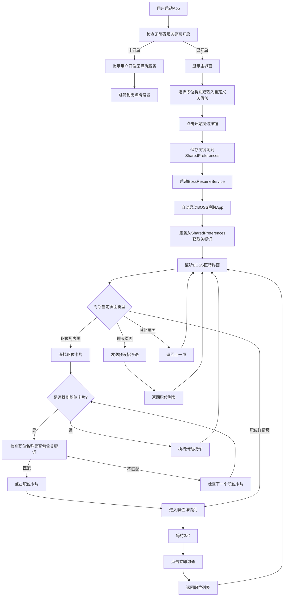

# BOSS直聘自动投递


一个基于Android无障碍服务的BOSS直聘自动投递工具，通过AI驱动的界面识别和精确控制，实现招聘应用的全自动化操作。

## 🌟 核心技术亮点

- **高级无障碍服务实现**：利用AccessibilityService深度集成系统操作能力
- **多层次页面状态检测**：通过节点特征组合判断精确定位当前页面类型
- **智能失败恢复机制**：自动检测操作失败并通过多策略重试确保任务连续性
- **基于UI的状态机模型**：摒弃传统导航栈，实现纯UI状态驱动的操作流程
- **精确节点查找算法**：多维度节点特征匹配，确保在各种UI变化中稳定找到目标元素

## 🔍 工作原理详解

### 页面识别机制

系统采用多特征组合识别方法确定当前所处的页面类型：

```java
private PageType detectPageFromUI(AccessibilityNodeInfo rootNode) {
    // 1. 主界面(MAIN_LIST)判断标准
    List<AccessibilityNodeInfo> tabNodes = rootNode.findAccessibilityNodeInfosByText("职位");
    boolean positionTabSelected = false;
    for (AccessibilityNodeInfo node : tabNodes) {
        if (node.isSelected()) {
            positionTabSelected = true;
            break;
        }
    }
    
    List<AccessibilityNodeInfo> recommendNodes = rootNode.findAccessibilityNodeInfosByText("推荐");
    // 更多特征检测逻辑...
    
    if (positionTabSelected && (!recommendNodes.isEmpty() || !nearbyNodes.isEmpty())) {
        return PageType.MAIN_LIST;
    }
    
    // 2. 职位详情页与聊天页面判断
    // 基于关键UI元素和位置特征判断...
}
```

### 智能职位匹配

系统通过预定义的关键词集对职位进行智能过滤：

```java
private boolean matchesKeywords(String jobTitle) {
    if (jobTitle == null || jobTitle.isEmpty()) {
        return false;
    }
    
    jobTitle = jobTitle.toLowerCase();
    for (String keyword : keywords) {
        if (jobTitle.contains(keyword.toLowerCase())) {
            return true;
        }
    }
    return false;
}
```

### 自适应点击策略

根据不同场景采用最合适的交互方式：

1. **节点点击**：当目标元素可点击且可访问时
2. **父节点点击**：当目标元素不可点击但父节点可点击时
3. **坐标点击**：当节点点击方法失效时，通过精确坐标实现

### 防检测与稳定性措施

- **动态时间延迟**：非线性时间间隔，模拟人类操作习惯
- **操作频率控制**：限制点击和滑动频率，避免触发平台反作弊机制
- **会话状态恢复**：自动检测APP退出状态并重启应用

## 📊 系统架构

### 核心组件

1. **BossResumeService**：继承自AccessibilityService，是整个系统的核心引擎
2. **页面处理器**：针对不同页面类型的专用处理逻辑
3. **节点查找引擎**：通过多维度特征组合定位界面元素
4. **操作执行器**：实现点击、滑动、返回等各类交互操作
5. **状态管理器**：维护应用整体状态与操作上下文

### 事件流转流程

```
接收无障碍事件 → 页面类型检测 → 状态更新 → 选择处理策略 → 执行操作 → 结果校验 → 后续流程决策
```

### 流程图


这个流程图展示了应用的主要工作流程：
1. 应用启动和初始化
2. 用户选择关键词和启动服务
3. 服务监听界面变化
4. 根据不同页面类型执行相应操作
5. 包含了关键的判断分支和循环逻辑

图中包含了主要的功能点，如关键词匹配、页面识别、自动滑动等核心功能。

## 🔧 高级定制指南

### 关键词配置

```java
// 关键词列表可按需扩展
private List<String> keywords = Arrays.asList(
    "运维", "系统运维", "业务运维", "运维开发",
    "devops", "DevOps", "技术支持", "容器",
    "自动化运维", "IT", "交付", "云", "监控",
    "Linux", "集成", "实施", "驻场",
    "docker", "k8s", "kubernetes", "SRE"
);
```

### 防卡死机制

系统实现了多层次的防卡死措施：

1. **超时控制**：所有操作均有超时限制，避免无限等待
2. **状态检测**：定期检查系统状态，及时退出异常状态
3. **强制恢复**：当检测到长时间无进展时，自动执行返回操作重置状态


## 🔬 性能优化

1. **内存优化**：及时释放AccessibilityNodeInfo对象，避免内存泄漏
2. **CPU占用控制**：使用延迟操作和事件驱动模式，减少CPU占用
3. **电池优化**：通过智能休眠机制，减少不必要的操作和检测

## 🛡️ 安全考量

- **数据隔离**：应用不收集或传输任何个人信息
- **最小权限**：仅请求必要的无障碍服务权限
- **安全操作**：所有操作均在应用沙箱内执行，不涉及系统修改

## 🧪 测试与质量保障

- **场景测试**：针对各类招聘场景进行全面测试
- **兼容性测试**：在不同Android版本和设备上验证
- **异常恢复测试**：模拟各种异常情况，验证系统恢复能力

## 📘 技术博客与深度解析

- [Android无障碍服务开发指南](#)
- [UI自动化测试最佳实践](#)
- [如何构建稳定的自动化工具](#)

## 🧩 项目贡献指南

我们欢迎开发者参与改进这个项目。贡献前请注意：

1. 遵循现有代码风格和架构设计
2. 提交前完成充分测试
3. 提供详细的PR描述和改动理由

## 📜 免责声明

本工具仅供研究Android无障碍服务开发和自动化技术使用。使用者应遵守相关法律法规和平台规则，因不当使用造成的任何问题与开发者无关。

---

**技术支持**：如有技术问题，请提交Issue或通过项目讨论区联系我们。
